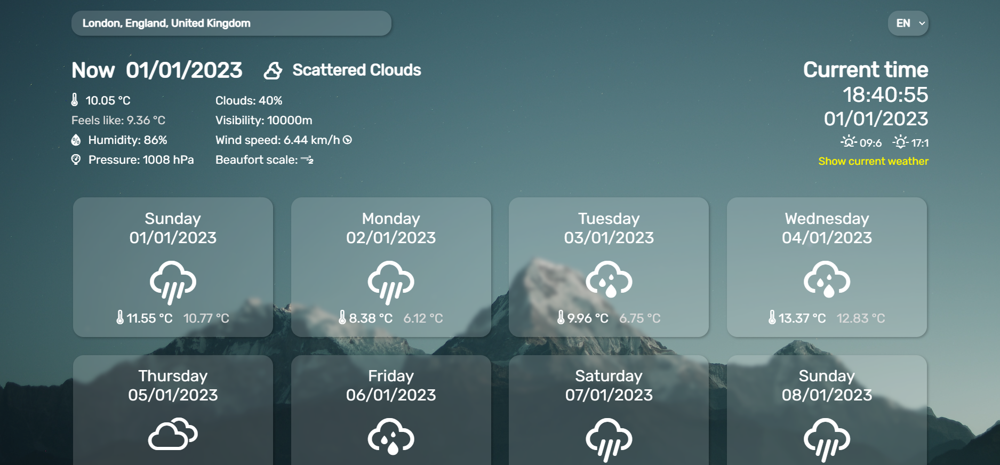

# Weather
Simple weather page in glassmorphism style that gives detailed data about current weather and next 7 days forecast. 
See [live demo](https://weather-artur-pas.netlify.app).

## Technologies Used
- HTML5
- CSS3
- React
- [OpenWeather OneCall API v2.5](https://openweathermap.org/) 
- [Geonames API](https://www.geonames.org).
- [Erik Flowers Weather Icons](http://erikflowers.github.io/weather-icons/)

## Features
- Detailed weather for choosen location
- 7 days forsecast
- Clock
- Searching for location 
- Language change
- Glassmorphic style
- Responsiveness

## Setup
Clone this repo to your desktop and run `npm install` to install all the dependencies and then `npm start` to start development sever.

## Acknowledgements
- This project was inspired by [this pen](https://codepen.io/Hyperplexed/pen/vYpXNJd).
