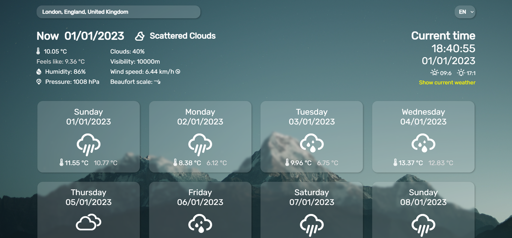

# Project Name
Simple weather page in React with Open Weather API and Geonames API.
Live demo [_here_](https://weather-artur-pas.netlify.app).

## Table of Contents
* [General Info](#general-information)
* [Technologies Used](#technologies-used)
* [Features](#features)
* [Setup](#setup)
* [Usage](#usage)
* [Project Status](#project-status)
* [Acknowledgements](#acknowledgements)

## General Information
- Provide general information about your project here.
- What problem does it (intend to) solve?
- What is the purpose of your project?
- Why did you undertake it?
<!-- You don't have to answer all the questions - just the ones relevant to your project. -->

## Technologies Used
- HTML5
- CSS3
- React
- [OpenWeather OneCall API v2.5](https://openweathermap.org/) 
- [Geonames API](https://www.geonames.org).
- [Erik Flowers Weather Icons](http://erikflowers.github.io/weather-icons/)

## Features
List the ready features here:
- Detailed weather for choosen location
- 7 days forsecast
- Clock
- Searching for location 
- Language change
- Glassmorphism
- Responsiveness

## Setup
What are the project requirements/dependencies? Where are they listed? A requirements.txt or a Pipfile.lock file perhaps? Where is it located?

Proceed to describe how to install / setup one's local environment / get started with the project.

## Usage
How does one go about using it?
Provide various use cases and code examples here.

`write-your-code-here`

## Project Status
Project is: complete

## Acknowledgements
- This project was inspired by [this pen](https://codepen.io/Hyperplexed/pen/vYpXNJd).
